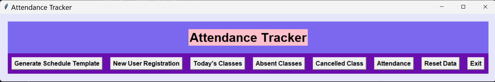
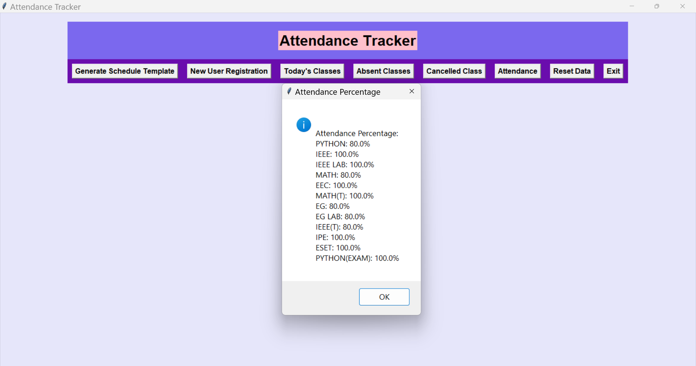

# Attendance Tracker

The Attendance Tracker is a simple and user-friendly desktop application built using Python and Tkinter. It allows users to track class attendance, mark absences, and manage class schedules effortlessly. Whether you are a student, teacher, or anyone involved in a class-based environment, this application can help you keep track of attendance records efficiently.

## Features

- **Class Schedule Registration:** Users can register a new class schedule by importing an Excel file containing the class details. The application will read the file, extract the schedule data, and store it securely in a SQLite database.

- **Today's Classes:** Users can quickly view the classes scheduled for the current day with just a click of a button. This feature helps users plan their day effectively.

- **Mark Absent Classes:** The application allows users to mark absent classes for the current day easily. It prompts the user to confirm attendance for each class, and based on the response, records the absences securely in the database.

- **Mark Cancelled Class:** Users can mark a class as canceled for the current day. The application prompts the user to confirm the cancellation, and the information is recorded for attendance calculations.

- **Calculate Attendance Percentage:** The Attendance Tracker calculates the attendance percentage for each class based on the recorded attendance and canceled classes. It helps users keep track of their attendance performance.

- **Reset Data:** Users have the option to reset all data in the application, including the schedule, absences, and canceled classes. The data is deleted from the database, and the application starts afresh.

## How to Use

1. **Installation:**
   - Clone the repository to your local machine using `git clone`.
   - Install the required libraries using `pip install -r requirements.txt`.

2. **Run the Application:**
   - Run the application by executing the `AttendanceTracker.py` script with Python.

3. **New User Registration:**
   - Click on the "New User Registration" button to register a new class schedule.
   - Select an Excel file containing the class schedule details.
   - The application will read the file and store the schedule data securely in the database.

4. **Today's Classes:**
   - Click on the "Today's Classes" button to view the classes scheduled for the current day.
   - A pop-up message will display the class names for the day.

5. **Mark Absent Classes:**
   - Click on the "Absent Classes" button to mark absent classes for the current day.
   - For each class, the application will prompt the user to confirm attendance.
   - If the user marks a class as absent, the absence will be recorded securely in the database.

6. **Mark Cancelled Class:**
   - Click on the "Cancelled Class" button to mark a class as canceled for the current day.
   - For each class, the application will prompt the user to confirm the cancellation.
   - If the user confirms, the cancellation will be recorded securely in the database.

7. **Calculate Attendance:**
   - Click on the "Attendance" button to calculate the attendance percentage for each class.
   - A pop-up message will display the attendance percentage for each class based on the recorded attendance and canceled classes.

8. **Reset Data:**
   - Click on the "Reset Data" button to reset all data in the application.
   - A confirmation message will prompt the user to confirm the data reset.
   - All data, including the schedule, absences, and canceled classes, will be deleted from the database.

9. **Exit Application:**
   - Click on the "Exit" button to exit the application.
   - A confirmation message will prompt the user to confirm the exit.

## Screenshots

## Requirements

- Python 3.x
- Tkinter
- pandas
- SQLite3

## License

This project is licensed under the MIT License - see the [LICENSE](LICENSE) file for details.

## Acknowledgments

Special thanks to the developers of Python, Tkinter, pandas, and SQLite3 for providing the tools and libraries to create this application.

---

Feel free to contribute to this project by reporting issues or creating pull requests. Happy coding!
